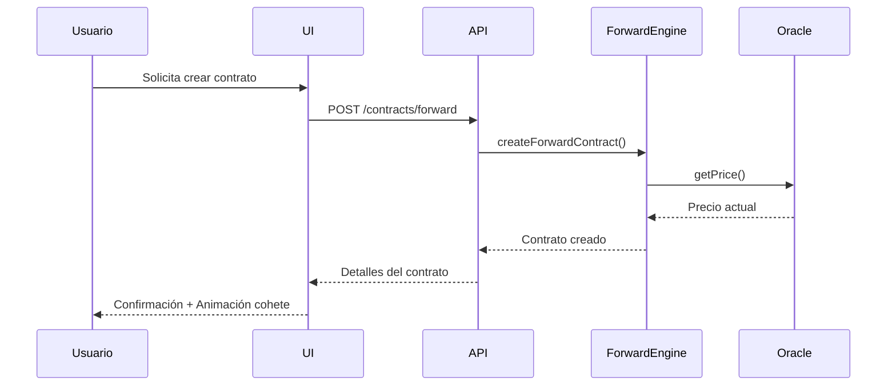
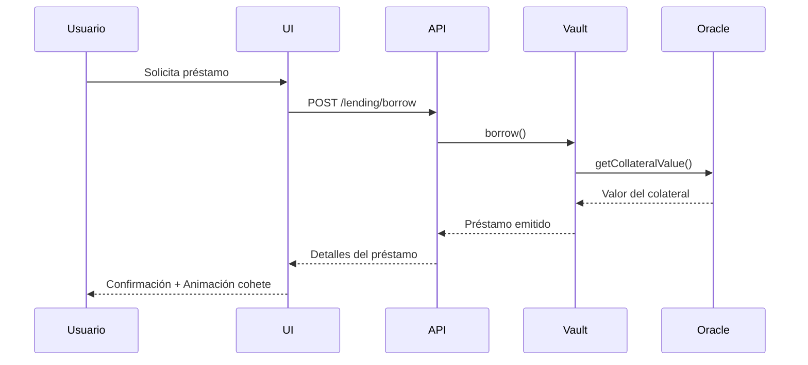

# Arquitectura de BitForward v2.0

## Visión General

BitForward es una plataforma DeFi empresarial para la gestión de contratos forward, préstamos con colateral y análisis financiero avanzado. La plataforma está diseñada con un tema espacial unificado que representa el "despegue" y crecimiento de las inversiones.

## Estructura del Proyecto

```
BitForward/
├── assets/                      # Recursos estáticos
│   ├── logo-rocket-animated.svg # Logo animado de cohete
│   ├── favicon.svg             # Favicon
│   └── icons/                  # Iconos varios
├── css/                        # Estilos
│   ├── space-background.css    # Fondo espacial con estrellas
│   ├── rocket-theme.css        # Componentes temáticos de cohete
│   ├── corporate.css           # Estilos para sección corporativa
│   ├── lending.css             # Estilos para sección de préstamos
│   ├── dashboard.css           # Estilos para dashboard
│   ├── auth.css                # Estilos para autenticación
│   └── ...
├── js/                         # JavaScript
│   ├── space-animations.js     # Animaciones espaciales
│   ├── rocket-animations.js    # Animaciones de cohetes
│   ├── rocket-space-theme.js   # Integración de tema espacial
│   ├── space-theme-config.js   # Configuración del tema
│   ├── space-theme-loader.js   # Cargador dinámico de recursos
│   ├── api.js                  # Cliente API
│   ├── blockchain.js           # Integraciones blockchain
│   ├── dashboard.js            # Lógica del dashboard
│   ├── lending.js              # Lógica de préstamos
│   └── ...
├── contracts/                  # Smart Contracts
│   ├── BitForwardContract.sol  # Contrato principal
│   ├── ForwardEngine.sol       # Motor de contratos forward
│   ├── Vault.sol               # Bóveda de activos
│   └── ...
├── server/                     # Backend
│   ├── server.js               # Servidor principal
│   ├── routes/                 # Rutas API
│   ├── services/               # Servicios
│   └── ...
└── dashboard-app/              # Aplicación React para dashboard
    ├── src/
    │   ├── components/         # Componentes React
    │   ├── context/            # Contextos
    │   └── ...
    └── ...
```

## Capas de Arquitectura

### 1. Frontend - Tema Espacial Unificado

El frontend utiliza un tema espacial unificado con los siguientes componentes:

- **Tema Base:** Estilo espacial con fondo de estrellas, nebulosas y meteoros
- **Elementos de Cohete:** Animaciones de cohetes para representar crecimiento, progreso y éxito
- **Componentes Interactivos:** Tarjetas, botones y formularios con efectos espaciales
- **Sistema de Carga Dinámica:** Los recursos se cargan según sea necesario para optimizar el rendimiento

### 2. Smart Contracts - Motor de Contratos Forward

La capa de contratos inteligentes gestiona:

- **ForwardEngine:** Motor para crear y liquidar contratos forward
- **Vault:** Bóveda para gestionar colaterales y activos
- **Adapters:** Adaptadores para diferentes protocolos y tokens
- **Oracle:** Oráculos para precios y datos externos

### 3. Backend - Servicios y API

El backend proporciona:

- **API REST:** Para interactuar con la plataforma
- **Servicios Blockchain:** Para interactuar con contratos inteligentes
- **Autenticación:** Sistema de autenticación empresarial
- **Análisis:** Procesamiento y almacenamiento de datos analíticos

## Flujos Principales

### 1. Creación de Contratos Forward



### 2. Préstamo con Colateral



## Integración del Tema Espacial

El tema espacial está integrado en todas las páginas a través de:

1. **space-theme-loader.js:** Carga dinámicamente los recursos necesarios
2. **rocket-space-theme.js:** Aplica clases y estilos a los elementos DOM
3. **space-animations.js:** Maneja las animaciones de estrellas y elementos espaciales
4. **rocket-animations.js:** Gestiona las animaciones específicas de cohetes

Los efectos visuales representan conceptos financieros:
- **Cohetes:** Crecimiento, despegue de inversiones
- **Estrellas:** Oportunidades en el universo financiero
- **Nebulosas:** Fondos y pools de liquidez
- **Meteoros:** Eventos de mercado importantes

## Consideraciones Técnicas

### Rendimiento
- Carga progresiva de recursos
- Optimización de animaciones CSS vs. JavaScript
- Minificación de assets en producción

### Accesibilidad
- Respeto de preferencias `prefers-reduced-motion`
- Alternativas textuales para elementos visuales
- Contraste adecuado de colores

### Seguridad
- Protección contra XSS en animaciones dinámicas
- Validación de datos en servicios blockchain
- Auditoría de smart contracts

## Próximos Pasos en el Roadmap

### Q4 2025 - Foundation
- Implementar tema espacial completo en todas las páginas
- Desplegar contratos en testnet
- Desarrollar pantallas de análisis con gráficos animados

### Q1 2026 - MVP Launch
- Desplegar contratos en mainnet
- Implementar integración multi-chain
- Lanzar programa de referidos con animaciones espaciales

### Q2 2026 - Growth
- Añadir nuevos instrumentos financieros
- Expandir a nuevas blockchains
- Mejorar experiencia visual con animaciones 3D

### Q3 2026 - Scale
- Implementar DAO para gobernanza
- Desarrollar aplicaciones móviles con tema espacial
- Expandir a nuevos mercados financieros

## Conclusión

La arquitectura de BitForward combina tecnologías frontend y blockchain con un tema espacial unificado para crear una experiencia financiera inmersiva y cohesiva. El diseño modular permite una fácil expansión y mantenimiento a medida que la plataforma crece.
